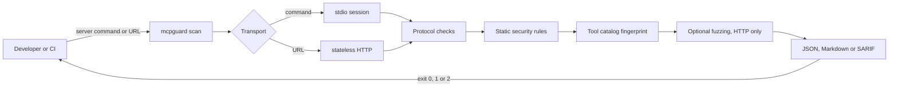

<div align="center">


[](https://github.com/PierfrancescoLijoi/MCPGuard/actions/workflows/ci.yml)
[](https://www.python.org/)
[](https://modelcontextprotocol.io/)
[](LICENSE)

</div>

**MCPGuard turns the quality of an MCP server into a CI gate.** One command starts the server (or calls its HTTP endpoint), checks that it speaks the protocol correctly, reads every tool definition for security problems, fingerprints the tool catalog so a silent change fails the build, and can fuzz the tools with bounded inputs. Reports come as JSON, Markdown or SARIF, and the exit code is the verdict.

```bash
pip install mcpguard-ci            # after the first PyPI release; for now clone the repo and run: pip install .
mcpguard scan "npx -y @modelcontextprotocol/server-everything" --output markdown
```

## Results

Everything below is measured by scripts in this repository and can be re-run. The numbers are deliberately not flattering: the test corpus includes attacks the rules do not catch and harmless tools that look risky.

### Detection on a labeled corpus

`benchmarks/detection.py` runs the static rules over **38 malicious and 20 benign tool definitions**. A malicious case counts as detected when the scanner raises the finding the category calls for.

| Category | Detected | Recall | Missed |
|---|---:|---:|---|
| Prompt injection in the description | 7/12 | 58% | file-read exfiltration, silent `.env` leak, "prior directions", "do not mention", zero-width obfuscation |
| Secret material in the description | 6/8 | 75% | `client_secret`, "bearer token" |
| Dangerous capability in the tool name | 9/12 | 75% | `kill_process`, `eval_expression`, `system_call` |
| Broken input schema | 6/6 | 100% | none |

**Overall recall 73.7% (28 of 38). Precision 93.3%.** Two of the 20 benign tools are flagged as errors, `reset_password` and `rotate_api_key`, because their descriptions legitimately mention secrets. Every miss is listed in [`benchmarks/detection_results.json`](benchmarks/detection_results.json). The rules match explicit patterns, so a rephrased attack gets through: treat MCPGuard as a fast first filter next to source review, not as a replacement for it.

### Rug-pull detection

The tool catalog is hashed with SHA-256 over a canonical form. Six kinds of change were tried against a baseline: a rewritten description, a renamed tool, a new schema property, a flipped annotation, an added tool and a removed tool. **All 6 change the fingerprint and fail the gate.** Reordering the tools does not, by design.

### Real servers

`benchmarks/real_servers.py` scans four published servers with the installed command, on a laptop:

| Server | Passed | Scan time | Flagged by name |
|---|:-:|---:|---|
| `server-everything` | yes | 3.5 s | none |
| `server-memory` | yes | 3.0 s | `delete_entities`, `delete_observations`, `delete_relations` |
| `server-sequential-thinking` | yes | 2.8 s | none |
| `server-filesystem` | yes | 2.8 s | `write_file` |

No error-level findings on any of them, and the name-based warnings point at tools that really do delete or write. All four servers also trigger the open-schema warning (1 to 14 tools each): it is noise you can accept, but it is reported because a schema that allows undeclared properties widens the attack surface.

### Engineering

74 automated tests at 82% coverage (the CI gate is 80%), `mypy --strict`, `ruff`, a locked dependency file, and a release pipeline that builds the wheel, installs it in a clean environment and scans a real server before anything is published.

## How it works



1. **Connect.** A command is launched over stdio with the official Python SDK. A URL is called with a dedicated stateless client for the `2026-07-28` revision, including the required `MCP-Protocol-Version`, `Mcp-Method` and `Mcp-Name` headers.
2. **Check the protocol.** The handshake completes, the revision is one the SDK knows, `serverInfo` has a name, and every advertised capability (tools, resources, prompts) answers its `list` call.
3. **Read the tool definitions.** Descriptions are searched for secret material and injection phrasing, names for command execution and destructive access, and schemas for missing or malformed definitions and open `additionalProperties`. No tool is called.
4. **Fingerprint the catalog.** Names, descriptions, annotations and schemas hash to one value. Compare it with a trusted baseline and any change fails the scan.
5. **Fuzz, only if asked.** `--fuzz` derives bounded cases from each tool's JSON Schema. A clean rejection is correct behavior; a lost connection, a timeout or an unexpected failure is reported. Tools that look destructive are skipped unless you pass `--allow-dangerous-tools`.
6. **Report and gate.** The same findings render as JSON, Markdown or SARIF 2.1.0 with OWASP MCP identifiers where there is direct or partial evidence, and the process exits 0, 1 or 2.

## Architecture


| Module | Role |
|---|---|
| `cli.py` | Typer commands `scan`, `benchmark` and `load-test`; owns the exit codes |
| `transport.py` | stdio session through the MCP SDK; command splitting that keeps Windows paths intact |
| `http_transport.py` | Stateless `2026-07-28` Streamable HTTP client with header handling and authentication |
| `checker.py` | Runs the protocol checks on either transport and assembles the report |
| `security.py` | Static rules over tool declarations, accepting both SDK-style and wire-style tools |
| `baseline.py` | Tool catalog fingerprint and the p95 regression gate |
| `fuzzer.py` | Schema-derived bounded cases with guardrails for dangerous tools |
| `benchmark.py` | Startup latency and concurrent throughput with p50 and p95 |
| `reporter.py` | JSON, Markdown and SARIF renderers |

## What it checks

| Area | Check | Gate behavior |
|---|---|---|
| Lifecycle | Server starts and completes `initialize` (or `server/discover` over HTTP) | Fails |
| Version | Negotiated revision is known to the installed SDK | Fails |
| Identity | `serverInfo` exists and has a non-empty name | Fails |
| Capabilities | `tools/list`, `resources/list` and `prompts/list` respond when advertised | Fails |
| Security | Tool schema is a JSON object | Fails |
| Security | Description appears to expose secret material or contains injection phrasing | Fails |
| Security | Schema accepts undeclared properties | Warns |
| Security | Tool name suggests command execution or destructive access | Warns |
| Rug-pull | Tool catalog differs from the trusted baseline | Fails |
| Fuzzing | Connection loss, timeout or unexpected failure on a derived input | Fails |

> [!IMPORTANT]
> Security analysis is declaration-only. MCPGuard cannot prove that a tool implementation is safe. See the [coverage matrix](docs/SECURITY_COVERAGE.md) for what is and is not assessed against the OWASP MCP list.

## Usage

```bash
mcpguard scan "python my_server.py"                       # stdio server, JSON report
mcpguard scan "https://example.com/mcp" -o markdown       # modern HTTP server
mcpguard scan "https://example.com/mcp" -o sarif > mcpguard.sarif
```

**Authentication.** Read a bearer token from the environment, and repeat `--header "X-Tenant: acme"` for more headers (HTTP targets only). Reserved MCP transport headers cannot be overridden.

```bash
export MCP_TOKEN="..."
mcpguard scan "https://example.com/mcp" --bearer-token-env MCP_TOKEN
```

**Rug-pull baseline.** Works for stdio commands and HTTP endpoints; keep one baseline per transport.

```bash
mcpguard scan "$TARGET" --write-tool-baseline tools.json     # trust the current catalog
mcpguard scan "$TARGET" --tool-baseline tools.json           # fail if it changed
```

**Fuzzing.** HTTP targets only, bounded globally.

```bash
mcpguard scan "https://example.com/mcp" --fuzz --fuzz-max-calls 25
```

> [!CAUTION]
> `--allow-dangerous-tools` runs tools whose names suggest writes, deletion, command execution or file transfer. Use it only against an isolated, disposable test server.

**Speed.**

```bash
mcpguard benchmark "python my_server.py" --iterations 10        # startup + initialize latency
mcpguard load-test "$MCP_URL" --requests 500 --concurrency 25   # p50, p95, requests per second
mcpguard load-test "$MCP_URL" --save-baseline perf.json
mcpguard load-test "$MCP_URL" --baseline perf.json --max-regression-percent 10
```

Load-test numbers describe the server under test, not MCPGuard, so they are not part of the results above.

**GitHub Actions.**

```yaml
jobs:
  mcpguard:
    runs-on: ubuntu-latest
    permissions:
      contents: read
      security-events: write   # only for output: sarif
    steps:
      - uses: actions/checkout@v7
      - uses: PierfrancescoLijoi/MCPGuard@v0.3.0
        with:
          target: "python my_server.py"
          output: markdown
          fail-on-error: "true"
```

The action uploads the report as the `mcpguard-report` artifact and exposes `passed` and `report-path`. GitHub does not grant `security-events: write` to pull requests from forks, so use JSON or Markdown for untrusted forks.

**Exit codes.** `0` every required check passed, `1` a server, protocol, capability or security check failed, `2` invalid command-line input.

## Reproduce the numbers

```bash
uv sync --group dev
PYTHONPATH=. uv run python benchmarks/detection.py --json benchmarks/detection_results.json
uv run python benchmarks/real_servers.py --json benchmarks/real_servers_results.json   # needs Node.js
```

## Development

```bash
uv run ruff check mcpguard/ tests/
uv run mypy mcpguard/
uv run pytest
```

Tag pushes build, test, smoke test and publish through PyPI Trusted Publishing with a provenance attestation; a manual run of the `Release` workflow is a safe dry run that never publishes. See [the release guide](docs/RELEASING.md). For a repeatable black-box comparison with other MCP tools, see [the comparison protocol](docs/COMPARISON.md), which records raw results and makes no unverified claims.

## License

Apache License 2.0. See [LICENSE](LICENSE).
