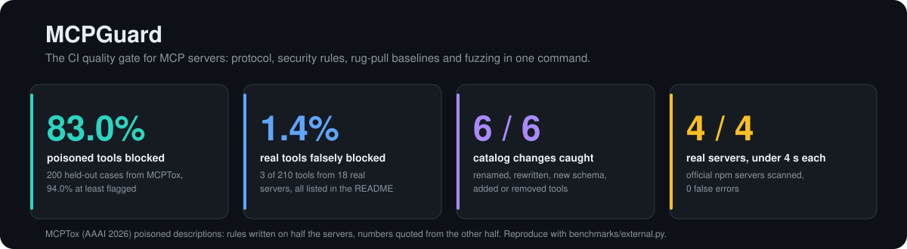
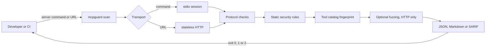
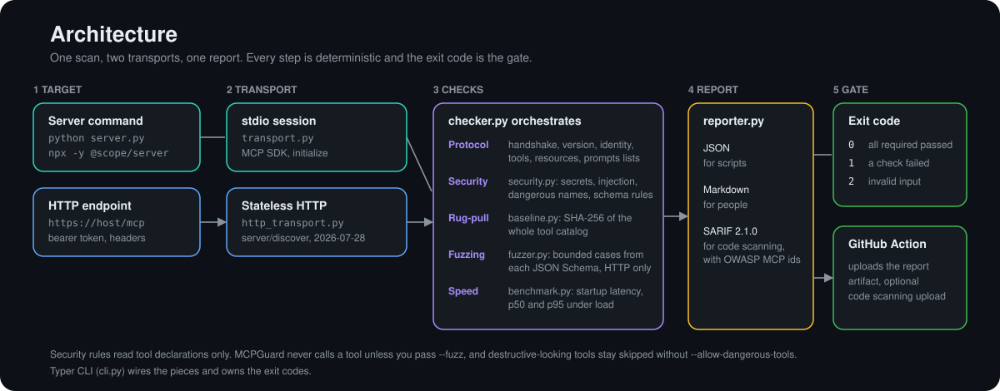

<div align="center">



[](https://github.com/PierfrancescoLijoi/MCPGuard/actions/workflows/ci.yml)
[](https://www.python.org/)
[](https://modelcontextprotocol.io/)
[](LICENSE)

</div>

**MCPGuard turns the quality of an MCP server into a CI gate.** One command starts the server (or calls its HTTP endpoint), checks that it speaks the protocol correctly, reads every tool definition for security problems, fingerprints the tool catalog so a silent change fails the build, and can fuzz the tools with bounded inputs. Reports come as JSON, Markdown or SARIF, and the exit code is the verdict.

```bash
pip install git+https://github.com/PierfrancescoLijoi/MCPGuard.git
mcpguard scan "npx -y @modelcontextprotocol/server-everything" --output markdown
```

## Results

Everything below is measured by scripts in this repository and can be re-run. The most important numbers use data the author did not write.

### Poisoned tool descriptions (external benchmark)

[MCPTox](https://github.com/zhiqiangwang4/MCPTox-Benchmark) (AAAI 2026) is a public set of **485 poisoned tool descriptions** written for 45 real MCP servers. `benchmarks/external.py` scans each one. The rules were written while looking only at half of the servers; the other half was run once, after the rules were frozen, and is the number to quote.

| | Cases | Blocked (error) | At least flagged |
|---|---:|---:|---:|
| **Held-out servers (never used to write rules)** | 200 | **166 (83.0%)** | **188 (94.0%)** |
| Servers used while writing the rules | 285 | 257 (90.2%) | 283 (99.3%) |

For context, the first version of the rules caught **5.8%** of this set. It had looked good only on a corpus the author wrote himself, which is why the external set was added. "Blocked" means the scan fails; "flagged" also counts warnings.

| Attack goal (held-out servers) | Blocked | Rate | At least flagged |
|---|---:|---:|---:|
| Credential leakage | 8/8 | 100% | 8/8 |
| Instruction tampering | 10/11 | 91% | 11/11 |
| Information manipulation | 42/47 | 89% | 45/47 |
| Service disruption | 29/33 | 88% | 33/33 |
| Financial loss | 7/8 | 88% | 8/8 |
| Privacy leakage | 31/37 | 84% | 33/37 |
| Data tampering | 15/18 | 83% | 16/18 |
| Message hijacking | 4/5 | 80% | 4/5 |
| Infrastructure damage | 14/23 | 61% | 23/23 |
| Code injection | 6/10 | 60% | 7/10 |

**What the rules look for.** A tool description should say what the tool does. Poisoned ones give the model orders: use another tool first, force a parameter to a literal value, read a key file, mail a result to an outsider, or "this outranks the user". Those orders are explicit enough to match, and most of this benchmark is exactly that.

**What this does not show.** MCPTox descriptions follow three fixed templates, so an attacker who rephrases freely, or who hides the order in a way no pattern covers, will get through. The numbers are a floor for the explicit attacks, not a guarantee. MCPGuard is a fast first filter next to source review, not a replacement for it.

### False positives on real tools

`benchmarks/collect_tools.py` lists the tools of 18 published servers (210 tool definitions, from the official `@modelcontextprotocol` servers to Playwright, Notion, GitHub and Firecrawl) and `benchmarks/external.py` scans them. **3 of 210 (1.4%) are blocked**:

- `firecrawl_scrape`, flagged for a cross-tool instruction;
- `firecrawl_credit_usage` and `fill_form` (Chrome DevTools), flagged because the description names a password or key.

Another one, Context7's `query-docs`, is only warned: its description legitimately says "you must call the resolve tool first", which looks the same as an attack on the page. Open input schemas raise a separate warning on most real tools.

### Rug-pull detection

The tool catalog is hashed with SHA-256 over a canonical form. Six kinds of change were tried against a baseline: a rewritten description, a renamed tool, a new schema property, a flipped annotation, an added tool and a removed tool. **All 6 change the fingerprint and fail the gate.** Reordering the tools does not, by design.

### Published servers

`benchmarks/real_servers.py` scans four of them with the installed command, on a laptop:

| Server | Passed | Scan time | Flagged by name |
|---|:-:|---:|---|
| `server-everything` | yes | 3.5 s | none |
| `server-memory` | yes | 3.0 s | `delete_entities`, `delete_observations`, `delete_relations` |
| `server-sequential-thinking` | yes | 2.8 s | none |
| `server-filesystem` | yes | 2.8 s | `write_file` |

The name-based warnings point at tools that really do delete or write. All four also trigger the open-schema warning (1 to 14 tools each): it is noise you can accept, but it is reported because a schema that allows undeclared properties widens the attack surface.

### A smaller corpus written by the author

`benchmarks/detection.py` runs the rules over 38 malicious and 20 benign definitions that the author wrote, including phrasings and look-alike tools meant to be hard. It finds 31 of 38 (81.6%) with 93.9% precision; two benign tools (`reset_password`, `rotate_api_key`) are flagged because they legitimately mention secrets. Because the rules were improved after seeing this corpus, treat it as a regression test and not as evidence. The raw misses are in [`benchmarks/detection_results.json`](benchmarks/detection_results.json).

### Engineering

84 automated tests at 84% coverage (the CI gate is 80%), `mypy --strict`, `ruff`, a locked dependency file, and a release pipeline that builds the wheel, installs it in a clean environment and scans a real server before anything is published.

## How it works



1. **Connect.** A command is launched over stdio with the official Python SDK. A URL is called with a dedicated stateless client for the `2026-07-28` revision, including the required `MCP-Protocol-Version`, `Mcp-Method` and `Mcp-Name` headers.
2. **Check the protocol.** The handshake completes, the revision is one the SDK knows, `serverInfo` has a name, and every advertised capability (tools, resources, prompts) answers its `list` call.
3. **Read the tool definitions.** Descriptions are searched for secret material, injection phrasing and orders aimed at the model (use another tool first, force a parameter to a literal, read a key file, send data to a fixed address, outrank the user). Names are checked for command execution and destructive access, and schemas for missing or malformed definitions and open `additionalProperties`. Zero-width and look-alike characters are normalized first. No tool is called.
4. **Fingerprint the catalog.** Names, descriptions, annotations and schemas hash to one value. Compare it with a trusted baseline and any change fails the scan.
5. **Fuzz, only if asked.** `--fuzz` derives bounded cases from each tool's JSON Schema. A clean rejection is correct behavior; a lost connection, a timeout or an unexpected failure is reported. Tools that look destructive are skipped unless you pass `--allow-dangerous-tools`.
6. **Report and gate.** The same findings render as JSON, Markdown or SARIF 2.1.0 with OWASP MCP identifiers where there is direct or partial evidence, and the process exits 0, 1 or 2.

## Architecture



| Module | Role |
|---|---|
| `cli.py` | Typer commands `scan`, `benchmark` and `load-test`; owns the exit codes |
| `transport.py` | stdio session through the MCP SDK; command splitting that keeps Windows paths intact |
| `http_transport.py` | Stateless `2026-07-28` Streamable HTTP client with header handling and authentication |
| `checker.py` | Runs the protocol checks on either transport and assembles the report |
| `security.py` | Static rules over tool declarations, accepting both SDK-style and wire-style tools |
| `poisoning.py` | Heuristics for tool poisoning: cross-tool orders, priority claims, forced arguments, key files, fixed exfiltration targets |
| `baseline.py` | Tool catalog fingerprint and the p95 regression gate |
| `fuzzer.py` | Schema-derived bounded cases with guardrails for dangerous tools |
| `benchmark.py` | Startup latency and concurrent throughput with p50 and p95 |
| `reporter.py` | JSON, Markdown and SARIF renderers |

## What it checks

| Area | Check | Gate behavior |
|---|---|---|
| Lifecycle | Server starts and completes `initialize` (or `server/discover` over HTTP) | Fails |
| Version | Negotiated revision is known to the installed SDK | Fails |
| Identity | `serverInfo` exists and has a non-empty name | Fails |
| Capabilities | `tools/list`, `resources/list` and `prompts/list` respond when advertised | Fails |
| Security | Tool schema is a JSON object | Fails |
| Security | Description appears to expose secret material or contains injection phrasing | Fails |
| Security | Description orders the model how to use another tool, claims to outrank the user, names a key file, or sends data to a fixed address | Fails |
| Security | Description forces a parameter to a fixed value, or requires calling another tool | Warns |
| Security | Schema accepts undeclared properties | Warns |
| Security | Tool name suggests command execution or destructive access | Warns |
| Rug-pull | Tool catalog differs from the trusted baseline | Fails |
| Fuzzing | Connection loss, timeout or unexpected failure on a derived input | Fails |

> [!IMPORTANT]
> Security analysis is declaration-only. MCPGuard cannot prove that a tool implementation is safe. See the [coverage matrix](docs/SECURITY_COVERAGE.md) for what is and is not assessed against the OWASP MCP list.

## Usage

```bash
mcpguard scan "python my_server.py"                       # stdio server, JSON report
mcpguard scan "https://example.com/mcp" -o markdown       # modern HTTP server
mcpguard scan "https://example.com/mcp" -o sarif > mcpguard.sarif
```

**Authentication.** Read a bearer token from the environment, and repeat `--header "X-Tenant: acme"` for more headers (HTTP targets only). Reserved MCP transport headers cannot be overridden.

```bash
export MCP_TOKEN="..."
mcpguard scan "https://example.com/mcp" --bearer-token-env MCP_TOKEN
```

**Rug-pull baseline.** Works for stdio commands and HTTP endpoints; keep one baseline per transport.

```bash
mcpguard scan "$TARGET" --write-tool-baseline tools.json     # trust the current catalog
mcpguard scan "$TARGET" --tool-baseline tools.json           # fail if it changed
```

**Fuzzing.** HTTP targets only, bounded globally.

```bash
mcpguard scan "https://example.com/mcp" --fuzz --fuzz-max-calls 25
```

> [!CAUTION]
> `--allow-dangerous-tools` runs tools whose names suggest writes, deletion, command execution or file transfer. Use it only against an isolated, disposable test server.

**Speed.**

```bash
mcpguard benchmark "python my_server.py" --iterations 10        # startup + initialize latency
mcpguard load-test "$MCP_URL" --requests 500 --concurrency 25   # p50, p95, requests per second
mcpguard load-test "$MCP_URL" --save-baseline perf.json
mcpguard load-test "$MCP_URL" --baseline perf.json --max-regression-percent 10
```

Load-test numbers describe the server under test, not MCPGuard, so they are not part of the results above.

**GitHub Actions.**

```yaml
jobs:
  mcpguard:
    runs-on: ubuntu-latest
    permissions:
      contents: read
      security-events: write   # only for output: sarif
    steps:
      - uses: actions/checkout@v7
      - uses: PierfrancescoLijoi/MCPGuard@main   # pin to a release tag once one is published
        with:
          target: "python my_server.py"
          output: markdown
          fail-on-error: "true"
```

The action uploads the report as the `mcpguard-report` artifact and exposes `passed` and `report-path`. GitHub does not grant `security-events: write` to pull requests from forks, so use JSON or Markdown for untrusted forks.

**Exit codes.** `0` every required check passed, `1` a server, protocol, capability or security check failed, `2` invalid command-line input.

## Reproduce the numbers

```bash
uv sync --group dev
git clone https://github.com/zhiqiangwang4/MCPTox-Benchmark          # poisoned descriptions, not copied here
PYTHONPATH=. uv run python benchmarks/collect_tools.py real_tools.json   # needs Node.js and uv
PYTHONPATH=. uv run python benchmarks/external.py MCPTox-Benchmark/pure_tool.json real_tools.json   --json benchmarks/external_results.json
PYTHONPATH=. uv run python benchmarks/detection.py --json benchmarks/detection_results.json
uv run python benchmarks/real_servers.py --json benchmarks/real_servers_results.json
```

The servers are fetched from npm at their latest version, so the tool counts can drift over time.

## Development

```bash
uv run ruff check mcpguard/ tests/
uv run mypy mcpguard/
uv run pytest
```

Tag pushes build, test, smoke test and publish through PyPI Trusted Publishing with a provenance attestation; a manual run of the `Release` workflow is a safe dry run that never publishes. See [the release guide](docs/RELEASING.md). For a repeatable black-box comparison with other MCP tools, see [the comparison protocol](docs/COMPARISON.md), which records raw results and makes no unverified claims.

## License

Apache License 2.0. See [LICENSE](LICENSE).
