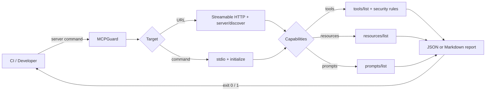

<div align="center">

# 🛡️ MCPGuard

### The CI quality gate for MCP servers

[](https://github.com/PierfrancescoLijoi/MCPGuard/actions/workflows/ci.yml)
[](https://www.python.org/)
[](https://modelcontextprotocol.io/)
[](LICENSE)

**Ship trustworthy MCP servers with protocol validation, security fuzzing, and performance gates**

</div>

---

MCPGuard validates legacy MCP servers over **stdio** and modern `2026-07-28`
servers over **Streamable HTTP**. It exercises advertised capabilities, inspects
tool definitions, offers opt-in bounded fuzzing, and measures latency or
concurrent throughput.

Designed for local development and CI/CD, it turns MCP quality into a repeatable
release gate: one command can catch protocol regressions, unsafe tool contracts,
crash-prone input handling, and performance degradation before deployment.

Reports are available as JSON, Markdown, or **SARIF 2.1.0** for GitHub code
scanning. Findings carry OWASP MCP identifiers where MCPGuard has direct or
partial evidence; see [the honest coverage matrix](docs/SECURITY_COVERAGE.md).



## What it checks

| Area | Check | Gate behavior |
|---|---|---|
| Lifecycle | Server starts and completes `initialize` | Fails |
| Version | Negotiated revision is supported by the installed Python SDK | Fails |
| Identity | `serverInfo` exists and has a non-empty name | Fails |
| Tools | Advertised `tools/list` responds | Fails |
| Resources | Advertised `resources/list` responds | Fails |
| Prompts | Advertised `prompts/list` responds | Fails |
| Security | Tool schema is a JSON object | Fails |
| Security | Description appears to expose secret material | Fails |
| Security | Schema accepts undeclared properties | Warns |
| Security | Tool name suggests command execution or destructive access | Warns |

> [!IMPORTANT]
> Security analysis is declaration-only. MCPGuard never invokes a server tool,
> so it cannot prove that tool implementations are safe. Findings are CI
> heuristics, not a substitute for source review, sandboxing, and runtime policy.

## Quick start

### Install from the repository

```bash
git clone https://github.com/PierfrancescoLijoi/MCPGuard.git
cd MCPGuard
pip install .
```

After the first PyPI release, install the published distribution from anywhere
with `pip install mcpguard-ci`. The executable and Python import remain
`mcpguard`.

### Scan a Python server

```bash
mcpguard scan "python my_server.py"
```

### Scan an npm server and render Markdown

```bash
mcpguard scan "npx -y @modelcontextprotocol/server-everything" --output markdown
```

### Scan a modern Streamable HTTP server

```bash
mcpguard scan "https://example.com/mcp"
```

HTTP targets use the stateless MCP `2026-07-28` envelope, including the required
`MCP-Protocol-Version`, `Mcp-Method`, and `Mcp-Name` routing headers.

Authenticated endpoints can read bearer tokens from the environment without
putting credentials in source files or CLI history:

```bash
export MCP_TOKEN="..."
mcpguard scan "https://example.com/mcp" --bearer-token-env MCP_TOKEN
```

Additional headers may be repeated with `--header "X-Tenant: acme"`. Reserved
MCP transport headers cannot be overridden.

## Opt-in tool fuzzing

```bash
mcpguard scan "https://example.com/mcp" --fuzz --fuzz-max-calls 25
```

Fuzz cases are derived from each tool's JSON Schema and bounded globally. The
fuzzer tests missing fields, minimum/maximum values, short/long strings, unknown
properties, and basic type boundaries. A clean JSON-RPC rejection is considered
correct behavior; connection loss, timeout, or an unexpected server failure is
reported as a failure.

Potentially destructive tools are skipped by default. Run them only against an
isolated disposable test server and opt in explicitly:

```bash
mcpguard scan "http://127.0.0.1:8000/mcp" \
  --fuzz --allow-dangerous-tools
```

> [!CAUTION]
> `--allow-dangerous-tools` can execute tools whose names suggest writes,
> deletion, command execution, or file transfer. Never enable it against a
> production server or valuable data.

<details>
<summary><strong>Example JSON report</strong></summary>

```json
{
  "target": "python my_server.py",
  "passed": true,
  "server": {
    "name": "example-server",
    "version": "1.0.0"
  },
  "protocol_version": "2025-11-25",
  "checks": [
    {
      "name": "initialize_handshake",
      "passed": true,
      "message": "Initialize handshake completed successfully"
    }
  ]
}
```

</details>

## Benchmark startup

```bash
mcpguard benchmark "python my_server.py" --iterations 10
```

Each iteration starts a clean process and measures the full connection plus
initialize handshake. The output contains the raw samples and aggregate values:

```text
minimum_ms ─────┐
average_ms ─────┼── startup and initialize latency
maximum_ms ─────┘
samples_ms ──────── every individual measurement
```

This is a local latency benchmark, not a throughput or load test.

## Load and throughput benchmark

```bash
mcpguard load-test "https://example.com/mcp" \
  --requests 500 --concurrency 25
```

The benchmark sends concurrent stateless `server/discover` requests over a
reused HTTP connection pool and reports:

| Metric | Meaning |
|---|---|
| `completed` / `errors` | Successful and failed requests |
| `requests_per_second` | Total attempted requests divided by wall time |
| `p50_ms` | Median request latency |
| `p95_ms` | 95th-percentile request latency |

Request count and concurrency are bounded CLI integers; concurrency cannot
exceed the number of requests.

Save a baseline and fail CI when p95 latency regresses beyond a threshold:

```bash
mcpguard load-test "$MCP_URL" --save-baseline performance.json
mcpguard load-test "$MCP_URL" --baseline performance.json \
  --max-regression-percent 10
```

## Tool rug-pull detection

Create a deterministic SHA-256 fingerprint of the complete advertised tool
catalog, then compare future scans against it:

```bash
mcpguard scan "$MCP_URL" --write-tool-baseline tools.json
mcpguard scan "$MCP_URL" --tool-baseline tools.json
```

Changes to names, descriptions, annotations, or schemas fail the gate and force
an explicit review of the new catalog.

## GitHub Actions

```yaml
name: MCP compliance

on: [push, pull_request]

jobs:
  mcpguard:
    runs-on: ubuntu-latest
    permissions:
      contents: read
      security-events: write
    steps:
      - uses: actions/checkout@v4
      - uses: PierfrancescoLijoi/MCPGuard@v0.3.0
        with:
          target: "python my_server.py"
          output: markdown
          fail-on-error: "true"
```

The action uploads the generated report as the `mcpguard-report` artifact and
exposes `passed` plus `report-path` outputs.

`security-events: write` is required only when `output: sarif` enables the
CodeQL upload step. GitHub does not grant that permission to pull requests from
forks, so use JSON or Markdown for untrusted fork workflows.

## Exit codes

| Code | Meaning |
|---:|---|
| `0` | Every required check passed |
| `1` | A server, protocol, capability, or security check failed |
| `2` | Invalid command-line input |

## Compatibility and scope

| Feature | Status |
|---|---|
| stdio transport | ✅ Supported |
| Streamable HTTP transport | ✅ Supported for stateless `2026-07-28` endpoints |
| MCP legacy lifecycle through `2025-11-25` | ✅ Supported over stdio |
| MCP `2026-07-28` stateless lifecycle | ✅ Supported over Streamable HTTP |
| JSON and Markdown reports | ✅ Supported |
| SARIF 2.1.0 / GitHub code scanning | ✅ Supported |
| Static tool-definition security checks | ✅ Supported |
| Startup benchmark | ✅ Supported |
| Tool execution fuzzing | ✅ Opt-in, bounded, destructive tools blocked by default |
| Load / throughput benchmarking | ✅ Concurrent HTTP benchmark with p50/p95 |
| Performance regression baselines | ✅ p95 threshold gate |
| Tool rug-pull detection | ✅ Deterministic catalog fingerprints |
| OAuth/API token authentication | ✅ Bearer token via environment and custom headers |
| Legacy Streamable HTTP sessions | 🚧 Not yet supported |
| Interactive OAuth authorization-code flow | 🚧 Not yet supported |

MCP `2026-07-28` replaced `initialize` with `server/discover`. MCPGuard uses the
Python SDK for legacy stdio sessions and a dedicated stateless HTTP client for
the modern request envelope.

## Development

```bash
uv sync --group dev
uv run ruff check mcpguard/ tests/
uv run mypy mcpguard/
uv run pytest
```

The test suite includes a deliberately vulnerable catalog under
`tests/fixtures/` and verifies detection of secret exposure, tool poisoning,
unsafe execution, malformed schemas, transport errors, and fuzzing crashes.

## Releases and independent comparison

Tag pushes trigger `.github/workflows/release.yml`, which builds wheel and sdist,
creates a GitHub artifact-provenance attestation, publishes through PyPI Trusted
Publishing, and attaches the same artifacts to a GitHub release. Configure the
`pypi` environment and PyPI Trusted Publisher before creating a `v*` tag. The
distribution is `mcpguard-ci`; the command and Python package remain `mcpguard`.

The same workflow can be started manually from the GitHub Actions page as a
safe dry run. Manual runs perform every build and validation step and upload the
distributions as a workflow artifact, but the publish job is always skipped.
See [the release guide](docs/RELEASING.md) for the exact account configuration.

For repeatable black-box comparisons with MCP Inspector and MCP-Scan, see
[the comparison protocol](docs/COMPARISON.md). It records raw machine-readable
results and intentionally avoids unverified marketing claims.

Project layout:

```text
mcpguard/
├── checker.py    # protocol and capability checks
├── security.py   # static tool-definition rules
├── benchmark.py  # latency measurements
├── fuzzer.py     # bounded JSON Schema-derived tool cases
├── http_transport.py # stateless 2026-07-28 Streamable HTTP
├── reporter.py   # JSON and Markdown reports
├── transport.py  # stdio session lifecycle
└── cli.py        # Typer commands and exit codes
```

## License

Apache License 2.0 — see [LICENSE](LICENSE).
