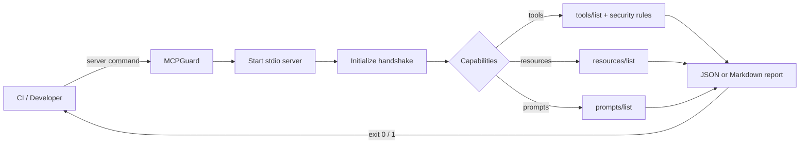

<div align="center">

# 🛡️ MCPGuard

### The CI quality gate for legacy MCP servers

[](https://github.com/PierfrancescoLijoi/MCPGuard/actions/workflows/ci.yml)
[](https://www.python.org/)
[](https://modelcontextprotocol.io/)
[](LICENSE)

**Validate protocol behavior · inspect tool schemas · measure startup latency**

</div>

---

MCPGuard launches an MCP server over **stdio**, performs the legacy initialize
handshake, exercises every advertised list capability, inspects tool definitions
without invoking them, and returns a deterministic result suitable for CI.



## What it checks

| Area | Check | Gate behavior |
|---|---|---|
| Lifecycle | Server starts and completes `initialize` | Fails |
| Version | Negotiated revision is supported by the installed Python SDK | Fails |
| Identity | `serverInfo` exists and has a non-empty name | Fails |
| Tools | Advertised `tools/list` responds | Fails |
| Resources | Advertised `resources/list` responds | Fails |
| Prompts | Advertised `prompts/list` responds | Fails |
| Security | Tool schema is a JSON object | Fails |
| Security | Description appears to expose secret material | Fails |
| Security | Schema accepts undeclared properties | Warns |
| Security | Tool name suggests command execution or destructive access | Warns |

> [!IMPORTANT]
> Security analysis is declaration-only. MCPGuard never invokes a server tool,
> so it cannot prove that tool implementations are safe. Findings are CI
> heuristics, not a substitute for source review, sandboxing, and runtime policy.

## Quick start

### Install from the repository

```bash
git clone https://github.com/PierfrancescoLijoi/MCPGuard.git
cd MCPGuard
pip install .
```

### Scan a Python server

```bash
mcpguard scan "python my_server.py"
```

### Scan an npm server and render Markdown

```bash
mcpguard scan "npx -y @modelcontextprotocol/server-everything" --output markdown
```

<details>
<summary><strong>Example JSON report</strong></summary>

```json
{
  "target": "python my_server.py",
  "passed": true,
  "server": {
    "name": "example-server",
    "version": "1.0.0"
  },
  "protocol_version": "2025-11-25",
  "checks": [
    {
      "name": "initialize_handshake",
      "passed": true,
      "message": "Initialize handshake completed successfully"
    }
  ]
}
```

</details>

## Benchmark startup

```bash
mcpguard benchmark "python my_server.py" --iterations 10
```

Each iteration starts a clean process and measures the full connection plus
initialize handshake. The output contains the raw samples and aggregate values:

```text
minimum_ms ─────┐
average_ms ─────┼── startup and initialize latency
maximum_ms ─────┘
samples_ms ──────── every individual measurement
```

This is a local latency benchmark, not a throughput or load test.

## GitHub Actions

```yaml
name: MCP compliance

on: [push, pull_request]

jobs:
  mcpguard:
    runs-on: ubuntu-latest
    steps:
      - uses: actions/checkout@v4
      - uses: PierfrancescoLijoi/MCPGuard@v0.1.0
        with:
          target: "python my_server.py"
          output: markdown
          fail-on-error: "true"
```

The action uploads the generated report as the `mcpguard-report` artifact and
exposes `passed` plus `report-path` outputs.

## Exit codes

| Code | Meaning |
|---:|---|
| `0` | Every required check passed |
| `1` | A server, protocol, capability, or security check failed |
| `2` | Invalid command-line input |

## Compatibility and scope

| Feature | Status |
|---|---|
| stdio transport | ✅ Supported |
| MCP legacy lifecycle through `2025-11-25` | ✅ Supported |
| JSON and Markdown reports | ✅ Supported |
| Static tool-definition security checks | ✅ Supported |
| Startup benchmark | ✅ Supported |
| Streamable HTTP transport | 🚧 Not yet supported |
| MCP `2026-07-28` stateless lifecycle | 🚧 Not yet supported |
| Tool execution fuzzing | 🚧 Not yet supported |
| Load / throughput benchmarking | 🚧 Not yet supported |

MCP `2026-07-28` replaced `initialize` with `server/discover`. The current
Python dependency used here exposes the legacy lifecycle through `2025-11-25`,
so MCPGuard reports its actual compatibility instead of claiming modern-era
coverage.

## Development

```bash
uv sync --group dev
uv run ruff check mcpguard/ tests/
uv run mypy mcpguard/
uv run pytest
```

Project layout:

```text
mcpguard/
├── checker.py    # protocol and capability checks
├── security.py   # static tool-definition rules
├── benchmark.py  # latency measurements
├── reporter.py   # JSON and Markdown reports
├── transport.py  # stdio session lifecycle
└── cli.py        # Typer commands and exit codes
```

## License

Apache License 2.0 — see [LICENSE](LICENSE).
